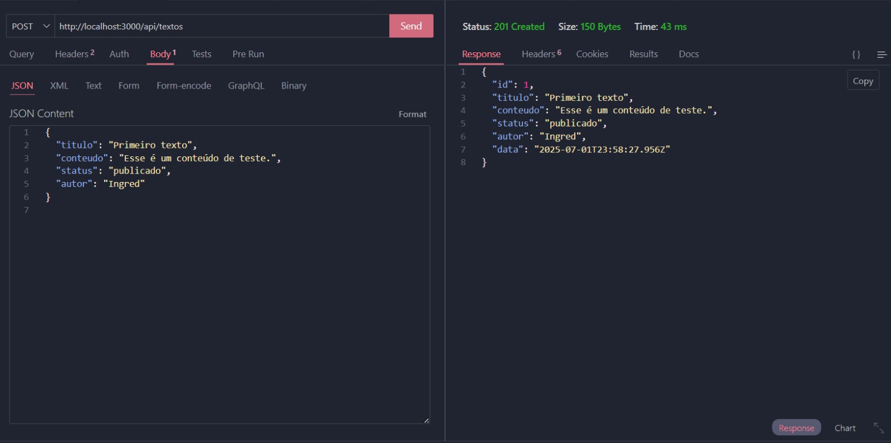

# 📚 Projeto API de Livros em TypeScript

Esta é uma API RESTful desenvolvida com **TypeScript** e **Express**, que permite realizar operações de CRUD (Create, Read, Update, Delete) sobre uma lista de livros armazenada em memória.

---

## 📁 Estrutura de Pastas

A API segue o padrão de **Clean Architecture**, separando responsabilidades por camadas:

```
├── src
│   ├── controllers/
│   └── services/
│   ├── models/
│   └── routes/
│   ├── storage/
│   └── index.ts/

```
---
### 🚀 Tecnologias Utilizadas

- [Node.js](https://nodejs.org/)
- [Express](https://expressjs.com/)
- [TypeScript](https://www.typescriptlang.org/)
- [Cors](https://www.npmjs.com/package/cors)
- [Nodemon](https://www.npmjs.com/package/nodemon) (dev)

---


## 📸 Exemplos de Testes

### ✅ Teste com Thunder Client - POST Update Task
  

### ✅ Teste com Thunder Client - GET Task
  


### 🔧 Como Rodar o Projeto

1. Clone o repositório:
   ```bash
   git clone https://github.com/seu-usuario/nome-do-repositorio.git
   cd nome-do-repositorio

2. Instale as dependências:
    ```bash
    npm install

3. Execute a API:
    ```bash
    npx ts-node-dev src/index.ts

4. Acesse:
    ```bash
    http://localhost:3000/api/books

👩‍💻 Desenvolvido por

Ingred Conceição – Desenvolvedora Fullstack em formação


